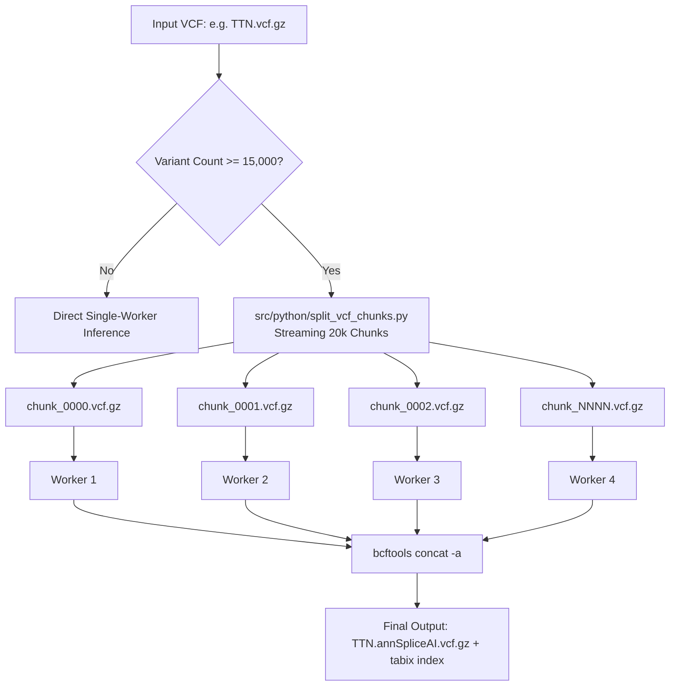

# Parallel SpliceAI VCF Chunking & High-Throughput Inference
**Date & Time**: `2026-08-18 16:31:00 CEST`  
**Target Architecture**: HPC SGE Cluster Execution & Local Sandbox  
**Scope**: High-throughput SpliceAI neural network inference for giant loci (`TTN`, `PKP2`, `FLNC`, `DSP`, `MYBPC3`).

---

## 1. Context & Motivation
Running SpliceAI at extended context distances (`-D 10000`, 20kb sequence window) on large cardiomyopathy loci sequentially was the primary computational bottleneck of the annotation pipeline:
* `TTN` (186,385 variants): ~20–70 hours sequentially on single-core CPU.
* `PKP2` (63,777 variants): ~69 hours sequentially.

Any cluster node preemption or transient I/O interruption caused the entire job to fail and restart from variant 1.

---

## 2. Implemented Architecture

### Key Capabilities Added:
1. **Automated Variant Thresholding**:
   * Genes with $< 15,000$ variants run with zero chunking overhead.
   * Loci with $\ge 15,000$ variants are automatically split into 20,000-variant chunks with complete VCF header fidelity.
2. **Dynamic Multi-Worker Pool**:
   * Runs concurrent worker sub-processes matching SGE `$NSLOTS` (default: 4 workers).
3. **Fault-Tolerant Chunk Checkpointing**:
   * If a run is interrupted, precomputed chunks (`chunk_XXXX.annSpliceAI.vcf.gz`) are automatically detected and skipped. Only unfinished chunks are computed.
4. **Automated Concatenation & Cleanup**:
   * Chunks are merged via `bcftools concat -a`, indexed via `tabix`, validated for record count equality, and the temporary scratch directory is cleaned.

---

## 3. Verification & Test Results

* **Python Unit Tests**: `pytest tests/python/test_vcf_chunking.py` $\rightarrow$ **2/2 PASSED**.
* **Full Python Suite**: `pytest tests/python/` $\rightarrow$ **27/27 PASSED (100%)**.
* **Bash Suite**: `bash tests/bash/test_cli_args_main.sh` $\rightarrow$ **PASSED**.
* **Git Commit**: `0488589`
