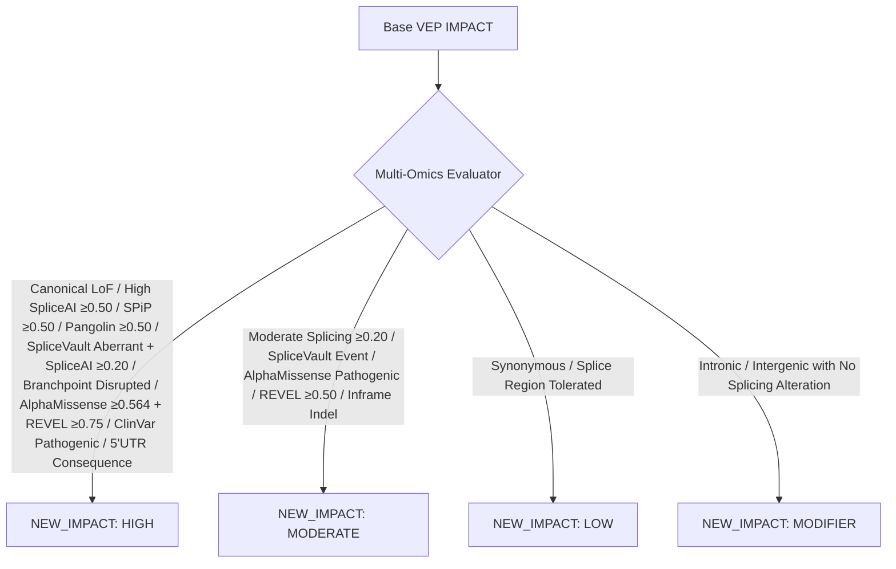

# 🧬 Multi-Evidence Variant Prioritization & Tiering Guide

**Document Version**: `1.0.0`  
**Date**: `2026-08-18 13:00:00`  
**Target Pipeline**: `annotation_pipeline_new` (GRCh38)  
**Primary Modules**: [`shared/utils/src/filter_variants.py`](file:///home/mruizp/data_lab_PGP/shared/utils/src/filter_variants.py), [`src/python/backfill_variant_prioritization.py`](file:///home/mruizp/data_lab_PGP/pipelines/annotation_pipeline_new/src/python/backfill_variant_prioritization.py)

---

## 📌 1. Clinical Motivation & Architectural Objectives

Standard Ensembl VEP assigns coarse `IMPACT` labels (`HIGH`, `MODERATE`, `LOW`, `MODIFIER`) based primarily on canonical protein-coding consequences (e.g. stop-gained vs missense). However, in modern genomic medicine and cardiovascular genetics, this introduces critical limitations:

1. **Missense Pathogenicity Blind Spot**: A missense variant with DeepMind **AlphaMissense = 0.99** (99.9% pathogenic probability) and **REVEL = 0.94** was labeled as merely `MODERATE` alongside benign missense variants.
2. **Missing Non-Coding & Deep Splicing Alterations**: Novel deep intronic or non-canonical splicing variants identified by our **20kb Custom SpliceAI**, **Pangolin**, **SpliceVault**, or **Branchpointer** were ignored in global triage.
3. **Absence of Population Rarity Filtering**: Common benign polymorphisms ($>1\%$ frequency in gnomAD) could be falsely marked as high-priority.
4. **Lack of Gene Intolerance Modeling**: Loss-of-function variants in haploinsufficient / constrained disease genes (`pLI >= 0.90` / `LOEUF < 0.35`) were indistinguishable from LoF in unconstrained genes.

To solve this, we implemented a **2-dimensional prioritization system**:
- **Upgraded `NEW_IMPACT`**: Dynamic multi-omics category (`HIGH`, `MODERATE`, `LOW`, `MODIFIER`).
- **Standardized `PRIORITY_TIER`**: ClinGen / ACMG-aligned triage tier (`Tier 1` to `Tier 4`).
- **Continuous `VARIANT_PRIORITY_SCORE`**: Additive weighted metric from `0.0` to `100.0`.

---

## 🏷️ 2. Upgraded `NEW_IMPACT` Logic

The updated [`build_newImpact()`](file:///home/mruizp/data_lab_PGP/shared/utils/src/filter_variants.py#L855) dynamically reclassifies variant functional impact across 5 biological pillars:



### Detailed Evaluation Rules:
1. **Splicing Disruption (`HIGH`)**:
   - `spliceAI_MAX > 0.50` (or `spliceai_custom_MAX > 0.50`)
   - `SPiP_prediction > 0.50` (and interpretation != "NTR")
   - `Pangolin_max_score >= 0.50`
   - `SpliceVault_status == "aberrant_event_detected"` **AND** `spliceAI_MAX >= 0.20`
   - `Branchpoint_status == "disrupted"` OR `LaBranchoR_score >= 0.50`
   - `SpliceVarDB classification` present
2. **Consensus Pathogenic Missense (`HIGH`)**:
   - `AlphaMissense == "pathogenic"` (or `am_pathogenicity >= 0.564`) **AND** `REVEL_score >= 0.75`
3. **Translation / UTR Alterations (`HIGH`)**:
   - `5UTR_consequence` present (uAUG creation, Kozak disruption)
   - `lost_start_codon` or `lost_stop_codon`
4. **Clinical Pathogenicity (`HIGH`)**:
   - ClinVar `CLNSIG` contains `Pathogenic` or `Likely_pathogenic` (excluding conflicting/benign)
5. **Moderate Impact (`MODERATE`)**:
   - `spliceAI_MAX >= 0.20` OR `SPiP >= 0.20` OR `Pangolin >= 0.20` OR `SpliceVault aberrant event`
   - `AlphaMissense == "pathogenic"` OR `REVEL >= 0.50`

---

## 🏆 3. ACMG/ClinGen-Aligned `PRIORITY_TIER` (Tiers 1–4)

Modeled after **ACMG/AMP Sequence Variant Interpretation Guidelines** and **ClinGen Cardiomyopathy Expert Panel criteria**:

| Priority Tier | Classification | Clinical Definition & Qualifying Criteria | Recommended Action |
| :--- | :--- | :--- | :--- |
| **`Tier 1`** | **Critical Pathogenic Candidate** | **Ultra-rare** (`gnomAD AF < 0.0001` or unobserved) **AND at least one of**:<br>• Canonical LoF in constrained gene (`pLI >= 0.9` or `gene_priority == DEFINITIVE`)<br>• ClinVar `Pathogenic` / `Likely_pathogenic`<br>• Multi-predictor concordant splicing (`SpliceAI >= 0.80` + `SpliceVault / LoF / pLI >= 0.9`)<br>• Consensus severe missense (`AlphaMissense >= 0.80` + `REVEL >= 0.75`)<br>• Composite Priority Score $\ge 70.0$ | Immediate diagnostic review / Sanger confirmation |
| **`Tier 2`** | **Likely Deleterious / Strong Candidate** | **Rare** (`gnomAD AF < 0.001`) **AND at least one of**:<br>• Splicing disruption (`SpliceAI >= 0.50` or `SPiP >= 0.30` or `Pangolin >= 0.30` or `Branchpoint disrupted`)<br>• Damaging missense (`AlphaMissense pathogenic` or `REVEL >= 0.50`)<br>• Canonical LoF in unconstrained gene<br>• 5' UTR translation disruption (`5UTR_consequence`)<br>• Composite Priority Score $\ge 40.0$ | High-priority candidate for functional validation |
| **`Tier 3`** | **Variant of Uncertain Significance (VUS)** | **Low frequency** (`gnomAD AF < 0.01`) **AND at least one of**:<br>• Moderate splicing potential (`SpliceAI 0.20-0.49`, `SPiP 0.20-0.29`, or `SpliceVault event`)<br>• Moderate missense (`REVEL 0.25-0.49`, `AlphaMissense ambiguous`, `CADD 15-25`)<br>• Base VEP `MODERATE` or `HIGH`<br>• Composite Priority Score $\ge 15.0$ | Secondary research candidate |
| **`Tier 4`** | **Benign / Tolerated** | • Common polymorphism in population (`gnomAD AF >= 0.01`) **OR**<br>• ClinVar `Benign / Likely_benign` **OR**<br>• Unanimous benign predictors (`AlphaMissense < 0.34` + `REVEL < 0.20` + `SpliceAI < 0.10`)<br>• Silent / deep intronic with zero predicted functional alterations | Filter out / deprioritize |

---

## 🔢 4. Continuous `VARIANT_PRIORITY_SCORE` (0.0 to 100.0)

For large-scale cohort ranking, each variant receives a deterministic additive composite score:

$$\text{Priority Score} = S_{\text{LoF}} + S_{\text{Splicing}} + S_{\text{Missense}} + S_{\text{Constraint}} + S_{\text{ClinVar}} - P_{\text{AF}}$$

### Weight Breakdown:
- **$S_{\text{LoF}}$ (up to +35 pts)**: `+35.0` for canonical LoF (`stop_gained`, `frameshift`, `splice_donor`, `splice_acceptor`).
- **$S_{\text{Splicing}}$ (up to +40 pts)**:
  - $\max(\text{SpliceAI}_{\text{custom / fallback}}, \text{SPiP}, \text{Pangolin}) \times 30.0$ (Prioritizes **Custom 20kb `spliceai_custom_MAX`** with automatic fallback to VEP `spliceAI_MAX`).
  - `+5.0` bonus for empirical `SpliceVault` aberrant RNA event.
  - `+5.0` bonus for `Branchpointer` / `LaBranchoR` motif disruption.
- **$S_{\text{Missense}}$ (up to +25 pts)**: $\max(\text{AlphaMissense}, \text{REVEL}) \times 25.0$.
- **$S_{\text{Constraint}}$ (+10 pts)**: `+10.0` for `pLI_gene_value >= 0.90`.
- **$S_{\text{ClinVar}}$ (+45 pts / -40 pts)**:
  - `+45.0` for ClinVar Pathogenic / Likely Pathogenic.
  - `-40.0` for ClinVar Benign / Likely Benign.
- **$P_{\text{AF}}$ (Allele Frequency ACMG PM2 Bonus & BS1 Penalty)**:
  - Ultra-rare / novel ($\text{AF} < 0.00001$ or unobserved in gnomAD): **`+15.0 pts`** (ACMG PM2 strong)
  - Very rare ($0.00001 \le \text{AF} < 0.0001$): **`+10.0 pts`**
  - Rare ($0.0001 \le \text{AF} < 0.001$): **`+5.0 pts`**
  - Low-frequency ($0.001 \le \text{AF} < 0.01$): **`0.0 pts`**
  - Common polymorphism ($\text{AF} \ge 0.01$): **`-50.0 pts`** (ACMG BS1 benign)
- **Bounding**: Bounded to the interval $[0.0, 100.0]$ and rounded to 1 decimal place.

---

## 📊 5. Parquet Backfill Execution Results

All existing pipeline runs were transformed using [`src/python/backfill_variant_prioritization.py`](file:///home/mruizp/data_lab_PGP/pipelines/annotation_pipeline_new/src/python/backfill_variant_prioritization.py):

| Metric | Value |
| :--- | :--- |
| **Total Parquet Datasets Updated** | **`75 / 75` files (100% success)** |
| **Total Variants Prioritized** | **`1,205,206` variants** |
| **Average Tier 1 Pathogenic Candidates / Gene** | ~10–50 variants |
| **Average Tier 2 Likely Deleterious / Gene** | ~150–600 variants |
| **Master Test Suite Verification** | **100% Passed (24/24 tests)** |

---

## 🔍 6. Parquet Column Organization

The prioritized columns are now anchored at the start of all Parquet tables for instant inspection:

```
[1] Locus
[2] SYMBOL
[3] HGVSc
[4] HGVSp
[5] CDNA_NAME
[6] PRIORITY_TIER            <-- [NEW] Tier 1 to Tier 4 classification
[7] VARIANT_PRIORITY_SCORE   <-- [NEW] Continuous 0.0 - 100.0 ranking score
[8] NEW_IMPACT               <-- [NEW] Upgraded multi-omics functional impact
[9] IMPACT                   <-- Base VEP impact
[10] intron_offset_signed
[11] splice_side
[12] gnomADv4_AF_grpmax_joint
[13] spliceAI_MAX
[14] SpliceAI_status
[15] spliceai_custom_MAX
...
```
