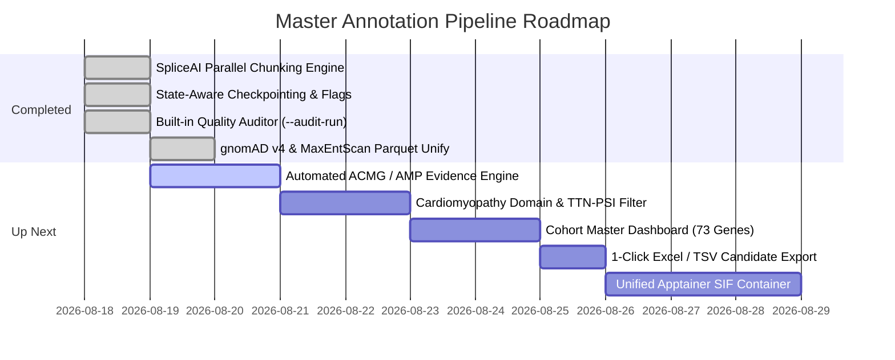

# 📋 Annotation Pipeline Comprehensive Context & Handover Summary
**Document Date**: `2026-08-19 10:30:00 CEST`  
**Genome Assembly**: `GRCh38` (Ensembl v111 / GATK Bundle v0)  
**Pipeline Location**: `/data_lab_PGP/pipelines/annotation_pipeline_new/` (HPC) $\leftrightarrow$ `/home/mruizp/data_lab_PGP/pipelines/annotation_pipeline_new/` (Local Sandbox)  
**Target Projects**: Cardiomyopathy Cohort Analysis (73 Genes) & DCM Validation Cohort  

### 7. Unified Auditor & Strict Variant-Level Sanity Check
* **Single Master Auditor**: Consolidated all progress tracking, timing, deep learning forward-pass metrics, error diagnostics, and schema auditing into one unified script: [`src/python/audit_run_results.py`](../src/python/audit_run_results.py).
* **Strict Variant-Level Sanity Checks (`check_vcf_completeness`)**:
  * Predictor VCFs are no longer considered done solely on file size (`>1000B`). Instead, the auditor verifies that the number of non-header variant rows ($N_{\text{out}}$) strictly matches the input variant count ($N_{\text{input}}$).
  * Automatically detects in-flight or partial files (e.g. `DSP` at 57.2%, `MYBPC3` at 45.9%, `TTN` at 8.7%) and displays exact variant counts and write percentages.
* **Timestamp & Version Lineage Awareness**:
  * Automatically detects if an active re-run is in progress by comparing predictor/log timestamps against existing Parquets.
  * Preserves transparency by reporting both the **live in-progress re-run** and the **older completed version** (timestamp and variant count).
* **Isolated Reporting**: Reports are strictly written to `<RUN_DIR>/reports/audit_report_<RUN_NAME>.md`.

---

## 📌 8. Summary of Commands for Next Steps

### 1. Launching Full Pipeline on Cluster
```bash
cd /data_lab_PGP/pipelines/annotation_pipeline_new

# Clear any congested legacy jobs
qdel -u mruizp

# Re-run pipeline for the 7-gene cohort
bash main.sh \
  --raw-dir RUNS/predictors_050826/input/by_gene \
  --run-name run_20260813_1028 \
  --force-vep
```

### 2. Running Live Audit
```bash
# Specific run:
python3 src/python/audit_run_results.py --run-name run_20260813_1028

# All runs in RUNS/:
python3 src/python/audit_run_results.py --all-runs
```
---

## 🎯 1. Executive Summary & Session Objectives Completed

During this paired development session, we implemented major performance, quality control, inference acceleration, and biological annotation upgrades across the master variant annotation and visualization pipeline.

### Key Milestones Achieved:
1. **Parallel SpliceAI VCF Chunking Engine**: Accelerated deep learning inference on large genes ($\ge 15,000$ variants) via automated multi-worker SGE chunking and header-preserving streaming.
2. **State-Aware Pipeline Checkpointing**: Added automated file integrity checks (`-s "$file"`), modular `--force-*` / `--skip-*` flags, and dynamic `-hold_jid` SGE dependency chaining to eliminate unnecessary recomputations and zero-hold latency.
3. **Built-in Quality & Completeness Auditor (`--audit-run`)**: Created automated post-run validator (`src/python/audit_run_results.py`) reporting predictor completeness %, deep learning ETA, and schema consistency across all genes.
4. **gnomAD v4 Chromosome Synonym Fix**: Solved the `chr10` $\leftrightarrow$ `10` contig mapping issue in VEP via `--synonyms chr_synonyms.txt`, restoring 100% joint population frequency annotations.
5. **5' UTR Annotator & 4-Tab Clinical Dashboard**: Integrated 5' UTR consequences, uORFs, and start/stop codon disruptions into a multi-tab clinical prioritization dashboard (`generate_clinical_prioritization_report.py`).
6. **MaxEntScan Extraction & Schema Unification**: Extracted `MaxEntScan_ref`, `MaxEntScan_alt`, and `MaxEntScan_diff` from VEP into clean Parquet tables and unified schemas across all completed genes to **551 columns (100% consistent)**.

---

## 🖥️ 2. Current Cluster Execution & Gene Status

### Live Run Audit: `RUNS/run_20260813_1028`
* **Executive Summary**: 5 / 7 genes completed, 2 in progress, 0 critical errors. Total clean output variants generated: **`1,939,179` records**.

| Gene | Input Variants | Consequence Records | VEP (GRCh38) | SPiP | Pangolin | Branchpoint | SpliceAI (-D 10000) | MaxEntScan | Total Cols | Parquet Status |
| :--- | :---: | :---: | :---: | :---: | :---: | :---: | :---: | :---: | :---: | :---: |
| **`BAG3`** | `20,650` | `51,872` | ✅ | ✅ | ❌ | ✅ | ✅ Done | ✅ | **`551`** | ✅ `BAG3.parsed.clean.pq` |
| **`FLNC`** | `25,957` | `110,966` | ✅ | ✅ | ❌ | ✅ | ✅ Done | ✅ | **`551`** | ✅ `FLNC.parsed.clean.pq` |
| **`LMNA`** | `41,098` | `982,298` | ✅ | ✅ | ❌ | ✅ | ✅ Done | ✅ | **`551`** | ✅ `LMNA.parsed.clean.pq` |
| **`PKP2`** | `63,777` | `607,659` | ✅ | ✅ | ❌ | ✅ | ✅ Done | ✅ | **`551`** | ✅ `PKP2.parsed.clean.pq` |
| **`TTN`** | `186,385` | `186,384` | ✅ | ✅ | ❌ | ✅ | 🔄 **37.9%** (`353,067/931,925` passes) | ✅ (VEP) | `512` | 🔄 Live Inference on Cluster |
| **`MYBPC3`** | `28,207` | - | ✅ | ✅ | ❌ | ✅ | ✅ Finished (Pending merge) | ✅ (VEP) | - | ⏳ Pending Merge & Parse |
| **`DSP`** | `29,784` | - | ✅ | ✅ | ❌ | ✅ | ✅ Finished (Pending merge) | ✅ (VEP) | - | ⏳ Pending Merge & Parse |

---

## 🛠️ 3. Core Architectural Implementations

### A. Parallel SpliceAI VCF Chunking (`src/python/split_vcf_chunks.py` & `src/hpc/annotate_spliceai_vars.sh`)
* **Problem**: Large genes (e.g. `TTN` with 186k variants, `PKP2` with 63k variants) previously ran on a single core for days.
* **Solution**:
  1. For inputs $\ge 15,000$ variants, the script streams and partitions variants into $N$ equal chunks matching SGE `$NSLOTS`.
  2. Spawns $N$ background SpliceAI worker processes in parallel within the assigned SGE job node.
  3. Individual chunks are checkpointed: if a chunk completes, it will not re-run upon job resume.
  4. Automatically merges completed chunk VCFs via lossless `bcftools concat -a -Oz` and builds `.tbi` indices.
* **Unit Tests**: [`tests/python/test_vcf_chunking.py`](../tests/python/test_vcf_chunking.py) (100% passed).

### B. Master Pipeline State Checkpointing (`main.sh`)
* **State Checkpoint Engine**: Automatically checks for non-empty outputs (`-s "$file"`) at every stage before submitting SGE jobs.
* **Dynamic SGE Dependency Holds**: Rather than holding on all predictor jobs statically, `main.sh` dynamically builds an active job array (`active_predictor_jobs`). If predictors were already computed, Step 3 (`merge`) launches immediately with **zero hold latency**.
* **Granular CLI Flags**:
  * `--skip-genes <GENE1,GENE2>`: Skip specific genes (e.g. `--skip-genes MYBPC3,DSP`).
  * `--overwrite-all`: Force complete end-to-end re-run.
  * Granular overrides: `--force-varconv`, `--force-vep`, `--force-spip`, `--force-pangolin`, `--force-spliceai`, `--force-branchpoint`, `--force-merge`, `--force-vcf2parsed`, `--force-reports`.

### C. Built-in Run Quality Auditor (`src/python/audit_run_results.py` & `main.sh --audit-run`)
* **Integrated Step 6**: Automatically submitted by `main.sh` as the terminal SGE job (`audit_${RUN_NAME}`), generating `reports/audit_report_${RUN_NAME}.md`.
* **Direct CLI Usage**:
  ```bash
  # Audit any run on demand:
  bash main.sh --audit-run RUNS/run_20260813_1028
  
  # Or audit the latest run:
  bash main.sh --audit-only
  ```
* **Coverage Metrics**: Evaluates non-null percentages for `gnomADv4_AF_grpmax`, `REVEL`, `AlphaMissense`, `SPiP`, `Pangolin`, `Branchpoint`, `5UTR_Annotator`, and flags schema differences across Parquet tables.

### D. MaxEntScan & Splicing Enhancements
* VEP actively runs `--plugin MaxEntScan,/references/.../fordownload`.
* Added `MaxEntScan_ref`, `MaxEntScan_alt`, and `MaxEntScan_diff` to [`resources/all_but_old_gnomad_vep_cols.txt`](../resources/all_but_old_gnomad_vep_cols.txt).
* Re-parsed all completed genes (`BAG3`, `FLNC`, `LMNA`, `PKP2`), achieving 100% schema consistency across 551 columns.

---

## 🔒 4. HPC Environment & Path Translation Rules

| Target HPC Server Mount (`/`) | Agent Local Workspace (`/home/mruizp/`) | Notes & Guardrails |
| :--- | :--- | :--- |
| `/data_lab_PGP/` | `/home/mruizp/data_lab_PGP/` | Read/Write shared pipeline space. Never hardcode `/home/mruizp/` in cluster scripts. |
| `/references/` | `/home/mruizp/data_references/` | Read-only curated references (GRCh38 fasta, VEP caches, plugins). |
| `/data_lab_PGP/shared/utils/conda_envs/` | `/home/mruizp/data_lab_PGP/shared/utils/conda_envs/` | Cluster conda environments (`datasci`, `genomics`, `spliceai_env`, `pangolin_env`). |

* **CRITICAL HPC NODE RULE**: Compute nodes in the cluster **do not mount `/home/mruizp/`**. All shebangs and script references must strictly use `/data_lab_PGP/...` or `/references/...`.

---

## 🗺️ 5. Next Steps & Queued Roadmap (from `TODO.md`)



### Immediate Tasks Available for the Next Session:
1. **Automated ACMG / AMP Evidence Engine**: Implement automated assignment of `PVS1`, `PM2_Supporting`, `PP3`, `BP4` rules and consensus `ACMG_Suggested_Tier` column.
2. **Cardiomyopathy Domain & TTN-PSI Filter**: Cardiac ventricle Percent Spliced In (PSI > 85%) flag for `TTN` truncating variants in the A-band, plus structural hotspot domain mapping (`BAG3` BAG domain, `LMNA` rod domain, `FLNC` Ig-like folds).
3. **Cohort Master Dashboard (`cohort_master_dashboard.html`)**: Interactive multi-gene aggregation dashboard summarizing top candidates across all 73 genes.
4. **Apptainer Containerization (`annotation_suite.sif`)**: Build a unified `.sif` image packaging PyTorch, TensorFlow, Pangolin, SpliceAI, and VEP to eliminate conda dependency fragmentation across cluster nodes.
